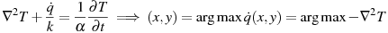

# thermocam-pcb
Tool for measuring temperature of PCB board with WorksWell thermo camera

## Requirements

### Operating System

32/64b x86  Linux, preferably Ubuntu 16.04, for maximum compatibility with the eBUS SDK. 

Alternatively, [Nix][] package manager can be used on any Linux
distribution. If you use Nix, skip to [Building and deploying with Nix](#building-and-deploying-with-nix).

[Nix]: https://github.com/nix-community/home-manager

### WIC SDK

You can find the official documentation of the WIC SDK at `https://software.workswell.eu/wic_sdk/Linux`.

#### Download & prerequisites
To download the WIC SDK installer, go to `software.workswell.eu/wic_sdk/Linux`. You need to enter your email to get the download link. Then extract and run the executable for your chosen distribution (`WIC_SDK-Linux_Ubuntu_16.04_64b-1.1.0.run` for 64bit Ubuntu 16.04). 

The packages `build-essential` and `libjpeg-dev` are requied to install the WIC SDK. The installer installs the WIC SDK and the eBUS SDK (required for the WIC SDK to work). 

#### Installation

All files are installed in /opt folder.

* The WIC SDK is found in folder: /opt/workswell/wic_sdk
* The eBUS SDK is found in folder: /opt/pleora/ebus_sdk/YOUR_LINUX_DISTRIBUTION

During the installation of the eBUS SDK:

* Select to add eBUS libraries to the path
* Don't install eBUS for Ethernet
* Select to install the eBUS daemon

 You can select for manual or automatic startup of the daemon - if you select manual, don't forget to run `service eBUSd start` before running the program.

If you selected `auto` running during installation, the daemon may still not start properly on startup. You may check its status with `systemctl status eBUSd`. If status shows "inactive (dead)", add runlevels at the following line to the daemon script located in `/etc/init.d/eBUSd`: 

`Default-Start:     2 3 4 5`

Adding runlevels to the script will enable `update-rc.d` to work with it. Make sure to run `sudo update-rc.d eBUSd defaults` and `sudo update-rc.d eBUSd enable` afterwards so the daemon runs at startup.

#### Environment setup

You need to set up your environment variables to run the program and use the WIC and eBUS SDKs. Run `/opt/workswell/wic_sdk/set_env_variables` to do so.

For me the script did not set all environment variables correctly. If this is the case for you, you may try use the `build/run` script produced by meson, which sets up the environment according to the meson configuration and runs the compiled binary.

Alternatively, write the script yourself according to the following (make sure to enter the folder name with your Linux distribution in the second command):

```
LD_LIBRARY_PATH=/opt/workswell/wic_sdk/lib:${LD_LIBRARY_PATH}

export PUREGEV_ROOT=/opt/pleora/ebus_sdk/YOUR_LINUX_DISTRIBUTION
export GENICAM_ROOT=$PUREGEV_ROOT/lib/genicam
export GENICAM_ROOT_V2_4=$GENICAM_ROOT
export GENICAM_LOG_CONFIG=$GENICAM_ROOT/log/config/DefaultLogging.properties
export GENICAM_LOG_CONFIG_V2_4=$GENICAM_LOG_CONFIG
if [ "$HOME" = "/" ]; then
export GENICAM_CACHE_V2_4=/.config/Pleora/genicam_cache_v2_4
else
export GENICAM_CACHE_V2_4=$HOME/.config/Pleora/genicam_cache_v2_4
fi
export GENICAM_CACHE=$GENICAM_CACHE_V2_4
export GENICAM_LIB_DIR=$GENICAM_ROOT/bin/Linux64_x64
mkdir -p $GENICAM_CACHE
export GENICAM_ROOT_V3_0=$GENICAM_ROOT
```

Whichever solution works for you, you may want to insert it into your .bashrc to be loaded each time the console starts.

### OpenCV

For development, download and compile OpenCV source version 2.4 (the latest stable build on Ubuntu 16.04). For simply running the executable on an Ubuntu 16.04 machine it is enough to install the libopencv-dev library.

Recorded video is stored in a lossless HuffYUV(HFYU) format which OpenCV does not have built in, so its codec is needed to be installed externally, e.g. by part of `libavcodec`.

### Webserver

We use the crow C++ webserver, which requires the `boost` and `pthread` libraries.

## Compilation

To compile the program, run:

    meson setup build [options]
	ninja -C build

Useful `options` are:
- `-Dpkg_config_path=$HOME/opt/opencv-2.4/lib/pkgconfig` to specify
  path to specific OpenCV installation.
- `-Debus_home=` or `-Dwic_home` to specify paths to the WIC SDK
- `-Dcpp_link_args=-static-libstdc++` if you compile on a system with
  newer libstdc++ and running the resulting binary on the target
  systems fails with: /usr/lib/x86_64-linux-gnu/libstdc++.so.6:
  version `GLIBCXX_3.4.26' not found
- other options reported by `meson configure` or `meson setup -h`.

## Building and deploying with Nix

Compiling thermocam-pcb with Nix package manager is simpler than the
above procedure, as Nix automatically handles all the dependencies.

1. Install Nix, e.g. `sh <(curl -L https://nixos.org/nix/install) --daemon`
2. (optional) Enable THERMAC binary cache to get prebuilt OpenCV
   - `nix-env -iA cachix -f https://cachix.org/api/v1/install`
   - `cachix use thermac`
3. Add WIC SDK to the nix store:
   - `nix-store --add-fixed sha256 WIC_SDK-Linux_Ubuntu_16.04_64b-1.1.0.run`
4. Run `nix build`
5. Run the program with `./result/bin/run` or `./result/bin/thermocam-pcb`.

To deploy the compiled program to the turbot board (where the camera
is connected) run:

1. Copy the program and all dependencies to turbot:
   ```sh
   nix copy --to ssh://root@turbot $(readlink result)
   ```
2. Test whether the program runs there:
   ```shell
   ssh ubuntu@turbot $(readlink result)/bin/run
   ```
3. If everything works well, install it permanently:
   ```sh
   ssh ubuntu@turbot "
       nix-env -i $(readlink result) &&
       systemctl --user daemon-reload &&
       systemctl --user restart thermocam-pcb
   "
   ```

## Usage

### Basic functionality

To simply display the thermocamera image, run the program without any arguments:

`./build/thermocam-pcb`

or

    ./build/run

This requires the WIC license file to be in the current directory. If your license file is elsewhere, you need to specify its directory with `--license-dir` to be able to use the camera.

### Additional functionality

You can use multiple functions, most even at the same time:

* Enter points on the image and print their temperature
* Export or import these points to a json format
* Record video or set video as input
* Set delay between prints/display 
* Display exported points and their corresponding camera image

For example, to import previously saved points, enter points by hand, export both into a single file and record video, run:

`./build/thermocam-pcb -p import.json --enter-poi=export.json -r recording.avi`

To show the saved points with the image at the time of saving (can be later used as a reference for tracking), run:

`./build/thermocam-pcb -s points.json`

### Setting video as input instead of camera

Add the path to your video to the arguments as `-v myvideo.avi`. 
Running the previous example(enter,import,export,record) with video input instead of camera can thus be done with:

`./build/thermocam-pcb -v myvideo.avi -p import.json --enter-poi=export.json -r recording.avi`

### Changing between views

There are 3 views available to display points and their temperature:

* Full view - the name of the point and its temperature is displayed next to the point
* Temperature only view - only the temperature is displayed next to the point
* Legend view - the point names and temperatures are listed next to the image and only their index is displayed next to the point

You can change between these views by pressing Tab.

### Enable point tracking

Tracking is enabled by `-t` and forbids the entering of points via `-e`.
The points to track and the reference image to compare to can be entered via `-p`.

### Detect heat source locations in a defined area

Define a border polygon (ideally an area with uniform emissivity) by entering points into a json file, in the format specified by the option `--enter-poi`. Heat source locations inside this polygon are sent to the webserver.

The heat source locations are calculated by applying a negative Laplacian kernel on the smoothed polygon area. This is based on the heat diffusion equation, by ignoring the temporal term and finding the local maxima of the negative Laplacian:



### Access webserver

The parameter `-w` starts a webserver on port `8080`.

* `ip_address:8080` shows the current thermocamera stream
* `ip_address:8080/temperatures.txt` returns the current POI Celsius temperatures in `name=temp` format
* `ip_address:8080/heat-sources.txt` returns the heat source locations in the format `heat_sources=x0,y0,neg_laplacian0;x1,y1,neg_laplacian1; ...`
* `ip_address:8080/points.txt` returns both POI temperatures and heat source locations in a single response
* `ip_address:8080/position-std.txt` returns the current rolling standard deviations of POI positions in `name=position` format, which is 0 if tracking is not enabled.

## Precise temperature measurement

The WIC specifications (see `https://workswell-thermal-camera.com/workswell-infrared-camera-wic`) state a measurement accuracy of ±2°C. If the measurement accuracy is lower than this, check that that the thermal emissivity of the measured object is equal to the value set in the WIC SDK - 0.95 by default. Masking the surface with black electrical insulating tape achieves an emissivity of 0.95-0.97.

If you are getting wrong values even with the right emissivity settings, it may be due to a bug in the WIC SDK.

### WIC SDK bug

For version 1.1 of the WIC SDK, if you use the license file for the WIC thermal camera, you are going to get wrong temperatures when calculating Celsius values from the 14-bit raw values coming from the Tau2 core inside the camera.

The reason for this is that there are various versions of the Workswell licence file (probably due to backwards-compatibility), this version number is stored in the license file. The version number read from the license file is 3, where it should be 2. This version number is set on line 3041 in function CameraSerialSettings::setCalibrationData in the CameraSerialSettings.cpp file.

Thus the solution is to either hard set the variable versionNumber on line 3041 to 2 in the CameraSerialSettings.cpp file, or set the version number to 2 in the license file.

The best solution would be to ask Workswell to fix this bug in the SDK and upload a new version to their website. Given how rarely they answer regarding this issue, this is unlikely to happen in the near future.

## Command line reference

<!-- help start -->
```
Usage: thermocam-pcb [OPTION...] [--] COMMAND...
Displays thermocamera image and entered points of interest and their
temperature. Writes the temperatures of entered POIs to stdout.

  -c, --csv-log=FILE         Log temperature of POIs to a csv file instead of
                             printing them to stdout.
  -d, --delay=NUM            Set delay between each measurement/display in
                             seconds.
  -e, --enter-poi[=FILE]     Enter Points of interest by hand, optionally save
                             them to json file at supplied path.
  -l, --license-dir=FILE     Path to directory containing WIC license file.
                             "." by default.
  -p, --poi-path=FILE        Path to config file containing saved POIs.
  -r, --record-video=FILE    Record video and store it with entered filename
  -s, --show-poi=FILE        Show camera image taken at saving POIs.
      --save-img-dir=FILE    Target directory for saving an image with POIs
                             every "save-img-period" seconds.
                             "." by default.
      --save-img-period=NUM  Period for saving an image with POIs to
                             "save-img-dir".
                             1s by default.
  -t, --track-points         Turn on tracking of points.
  -v, --load-video=FILE      Load and process video instead of camera feed
  -w, --webserver            Start webserver to display image and
                             temperatures.
  -?, --help                 Give this help list
      --usage                Give a short usage message
  -V, --version              Print program version

Mandatory or optional arguments to long options are also mandatory or optional
for any corresponding short options.

Requires path to directory containing WIC license file to run with camera.

Controls:
Tab                - Change view  (Full | Temperature only | Legend)
Mouse click (left) - Enter point  (only with --enter-poi)
Backspace          - Remove point (only with --enter-poi)
Esc                - Exit program

Report bugs to https://github.com/CTU-IIG/thermocam-pcb/issues.
```
<!-- help end -->
